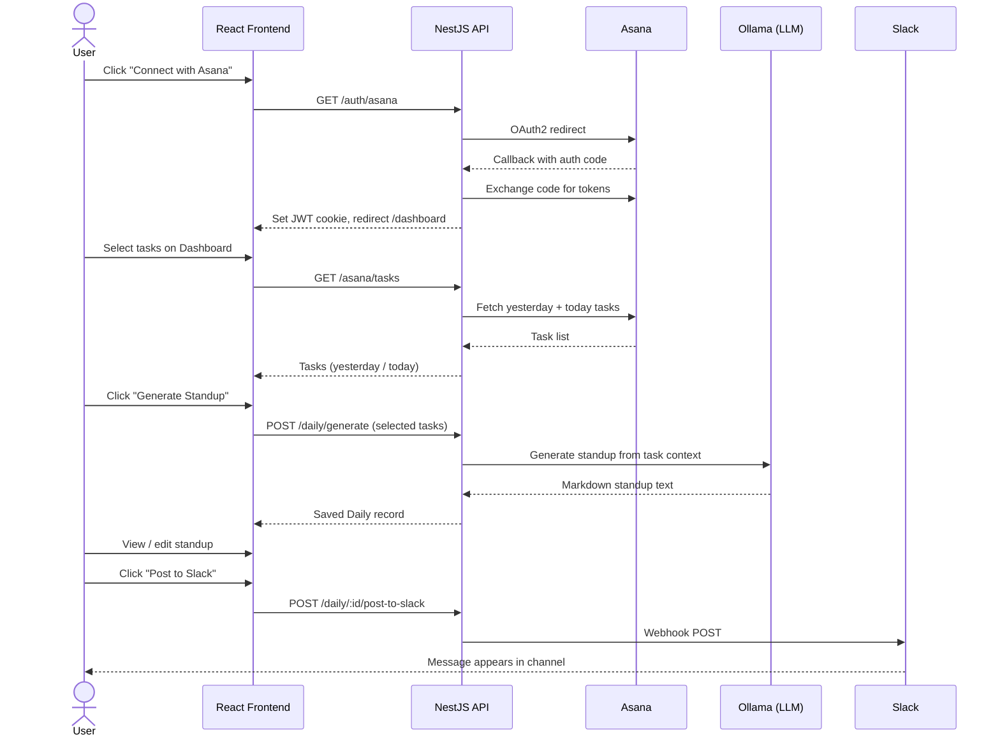

# DailyFlow

Automates daily standup reports by pulling your Asana tasks and generating a polished summary using a local LLM (Ollama). Post directly to Slack from the app.

## How it works



## Architecture

```
┌─────────────────────────────────────────────────────────┐
│                        Browser                          │
│                                                         │
│  React 19 · Vite · TanStack Router · TanStack Query     │
│  shadcn/ui · Tailwind CSS                               │
└────────────────────────┬────────────────────────────────┘
                         │  HTTP (Vite proxy → :3000)
                         │  httpOnly JWT cookie
┌────────────────────────▼────────────────────────────────┐
│                    NestJS API (:3000)                   │
│                                                         │
│  AuthModule     – Passport OAuth2 + JWT strategy        │
│  AsanaModule    – Asana REST API, token refresh         │
│  AiModule       – Ollama chat completions               │
│  DailyModule    – CRUD + Slack webhook                  │
│  UsersModule    – User entity, settings                 │
└──────┬────────────────────────────┬─────────────────────┘
       │  TypeORM + MySQL2          │  HTTP
┌──────▼──────┐             ┌───────▼───────┐
│  MySQL 8    │             │  Ollama LLM   │
│  (database) │             │  llama3.1:8b  │
└─────────────┘             └───────────────┘
```

## Tech stack

| Layer         | Technology                                               |
|---------------|----------------------------------------------------------|
| Frontend      | React 19, Vite 6, TanStack Router v1, TanStack Query v5  |
| UI            | shadcn/ui, Radix UI, Tailwind CSS v3                     |
| Backend       | NestJS 10, TypeORM 0.3, MySQL 8                          |
| Auth          | Asana OAuth2 (Passport), JWT in httpOnly cookie          |
| AI            | Ollama (`llama3.1:8b` by default, swappable)             |
| Notifications | Slack Incoming Webhooks                                  |
| Infra         | Docker Compose (db + ollama + api + web)                 |
| Tests         | Vitest + Testing Library (unit), Playwright (e2e)        |
| CI            | GitHub Actions (lint + test + build + e2e)               |

## Prerequisites

- Node 20+
- Docker & Docker Compose
- An [Asana developer app](https://app.asana.com/0/developer-console) with OAuth2 credentials

## Quick start (Docker)

```bash
# 1. Clone and copy env
cp .env.example .env

# 2. Fill in your Asana credentials and secrets
#    ASANA_CLIENT_ID, ASANA_CLIENT_SECRET, JWT_SECRET

# 3. Start everything (pulls Ollama model on first run — may take a few minutes)
docker compose up -d

# 4. Run database migrations
docker compose exec api npm run migration:run

# 5. Open http://localhost
```

## Local development

```bash
# Backend
cd dailyflow_be
cp .env.example .env   # set DB_HOST=localhost, OLLAMA_BASE_URL=http://localhost:11434
npm install
npm run migration:run
npm run start:dev      # http://localhost:3000

# Frontend (separate terminal)
cd dailyflow_fe
npm install
npm run dev            # http://localhost:5173 (proxied to :3000)
```

## Environment variables

| Variable              | Description                                             | Default                  |
|-----------------------|---------------------------------------------------------|--------------------------|
| `PORT`                | API port                                                | `3000`                   |
| `FRONTEND_URL`        | Frontend origin (used for OAuth redirect)               | `http://localhost`       |
| `COOKIE_SECURE`       | Set `true` in production (HTTPS-only cookie)            | `false`                  |
| `DB_HOST`             | MySQL host                                              | `db`                     |
| `DB_PORT`             | MySQL port                                              | `3306`                   |
| `DB_USER`             | MySQL user                                              | —                        |
| `DB_PASS`             | MySQL password                                          | —                        |
| `DB_NAME`             | MySQL database name                                     | —                        |
| `JWT_SECRET`          | Secret for signing JWT tokens (min 32 chars)            | —                        |
| `ASANA_CLIENT_ID`     | Asana OAuth2 app client ID                              | —                        |
| `ASANA_CLIENT_SECRET` | Asana OAuth2 app client secret                          | —                        |
| `ASANA_CALLBACK_URL`  | Must match the redirect URI in your Asana app settings  | —                        |
| `OLLAMA_BASE_URL`     | Ollama API base URL                                     | `http://localhost:11434` |
| `OLLAMA_MODEL`        | Model name to use for standup generation                | `llama3.1:8b`            |

## API docs

Swagger UI is available at `http://localhost:3000/api/docs` when the server is running.

## Screenshots

| Landing | Dashboard (light) | Dashboard (dark) |
|---------|-------------------|------------------|
|  |  |  |

| Generating | Standup detail | History | Settings |
|------------|----------------|---------|----------|
|  |  |  |  |

## Running tests

### Backend unit tests

```bash
cd dailyflow_be
npm test
```

20 unit tests covering `AsanaService`, `DailyService`, and `AiService`.

### Frontend unit tests

```bash
cd dailyflow_fe
npm test                 # run once
npm run test:watch       # watch mode
npm run test:coverage    # with coverage report
```

24 unit tests covering utility functions, theme helpers, UI components (`TaskCard`, `DailyCard`), and the `useAuth` hook.

### End-to-end tests (Playwright)

> Requires the frontend dev server (and optionally the backend) to be running.

```bash
# Start backend + DB first (or via Docker):
docker compose up -d db api

# Then run e2e:
cd dailyflow_fe
npm run test:e2e          # headless Chromium
npm run test:e2e:ui       # Playwright interactive UI
```

5 e2e tests cover the landing page and unauthenticated redirect behaviour.
